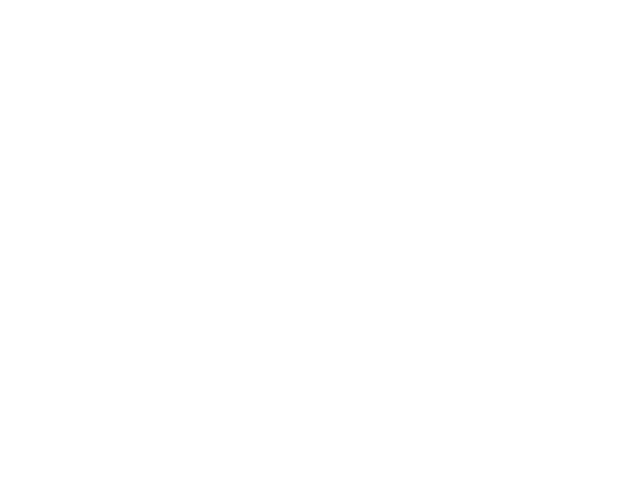

# UC Berkeley - Professional Certificate in Machine Learning and Artificial Intelligence
## Required assignment 5.1: Will the Customer Accept the Coupon?
Student: Claudia Jardon
## Description
For the program's first assignment, the goal is to respond the question "Will the customer accept the coupon?" by leveraging
the skills acquired in previous modules around statistics, ploting and data manipulation using pandas.

The solution is presented in a Jupyter Notebook. 

## Findings
**Bar coupon analysis**
- Those who frequent bars often are more likely to accept coupons to go to a bar.
- The oposit may also be true: Those that accepted the bar coupon likely often visit bars.

**Coffee House coupon analysis**
- The most popular time to accept the coffee coupon was 10AM
- The age group of below21 was the most prone to accept the coupon with a 0.6967741935483871 acceptance ratio.
-  There is a higher chance the user accepts the coupon if the Coffee House is in the same direction they were headed to: The acceptance ratio when the Coffee House is on the way is higher than when it's in the opposite direction by 3.867652495378926%

 

Given the provided correlation matrix, one can infer that:
1. The direction to the Coffee House, has the same correlation but with different signs, meaning that the direction has the same weigth in the decision but depending if it's the same or oposite direction, the relationship will be positive or negative.
2. We can also notice that the distance to the coupon has the biggest impact in the decision of accepting or rejecting the coupon.

**Next steps and recommendations**
- Run the analysis for the remaining coupon categories. 
- Recommended to assess the influence of addicional variables like sex, income and distance to shop. 

## Methodology
**Data Cleanup**
- The column 'car' was dropped from the analysis due to a large quantity of missing values. (Missing values: 12576 of 12684 entries)
- The columns CoffeeHouse, Restaurant20To50, CarryAway, RestaurantLessThan20 and Bar missing values were replaced with the mode as the missing values were more manageable. (Largest missing value count 217 of 12684 entries)

## Installation instructions
The project is built on Python leveraging multiple libraries commonly used in the Data Science practice. For the project to run adequately,
make sure to import the following libraries:
```
import matplotlib.pyplot as plt
import seaborn as sns
import pandas as pd
import numpy as np
```
Additionally, make sure to download the csv with the data available in the data folder of the project. The instructions to import file are contained within the Jupyter Notebook. Ensure the filepath is correct. 
```
data = pd.read_csv('data/coupons.csv')
```

Make sure to Run all cells for best performance.

## Usage: 
The analysis was done as a learning exercise. If you plan on using it, please give credit to the author and UC Berkeley. 
Data set is from UCI Machine Learning Repository. 

## Contributing 
Please contact the author if you would like to contribute to the project.

## Contact/Authors: 
Github user: Crazy4Cats
Owner: Claudia Jardón 